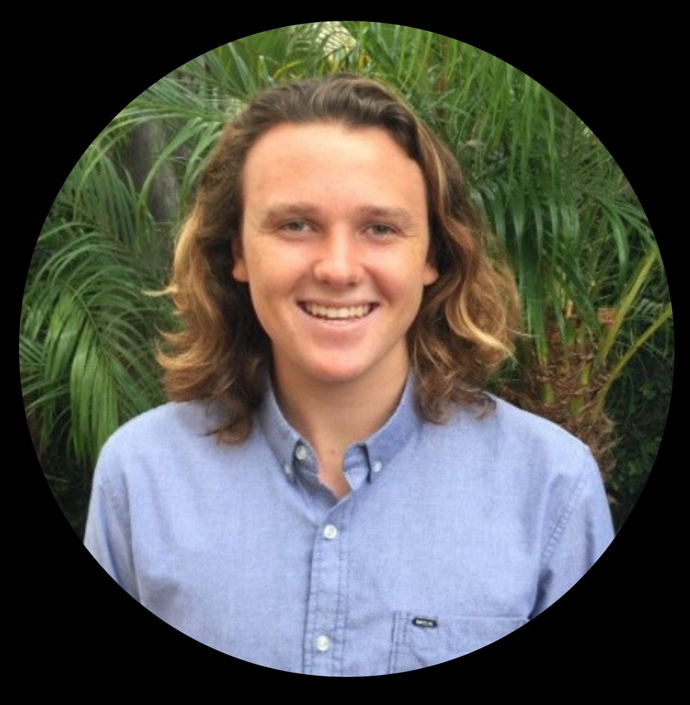

  <>

# Kestt van Zyl

## Education:

#### High School:

* Freshman Year Completed at Carlsbad High School
* Transferred to Carlsbad Seaside Academy
* Completed Sophmore, Junior, and Senior year at Carlsbad Seaside Academy
* Graduated from Carlsbad Seaside Academy in 2018 

#### Current Education:

* Currently Attending MiraCosta Community College
* Majoring in Computer Science
* In the process of completing an A.A. in Math and Science
* Expecting to transfer and attend a UC school in the Fall of 2021

## Skills:

#### Programming Languages:

* Java
* PHP
* CSS

#### Web Development:

* Familiar with Wordpress, Weebly, Wix
* Familiar with Shopify
* Experience building sites from scratch and building sites with the platforms mentioned above

#### SEO (Search Engine Optimization):

* Understand the importance of implementing keywords within a site
* Have a wide array of techniques to increase web traffic and visits to a site
* Familiar with Google Analytics and Google Search Console

#### Recruitment:

* Have experience in searching for candidates for a job opening
* Know how to find the correct candidates that fit the job description and meet the employers requirements
* Use LinkedIn to find candidates and to connect with potential clients

#### Additional Skills:

* Communication
* Public Speaking
* Creative and Artistic
* Excel in the both the individual and team work environment

